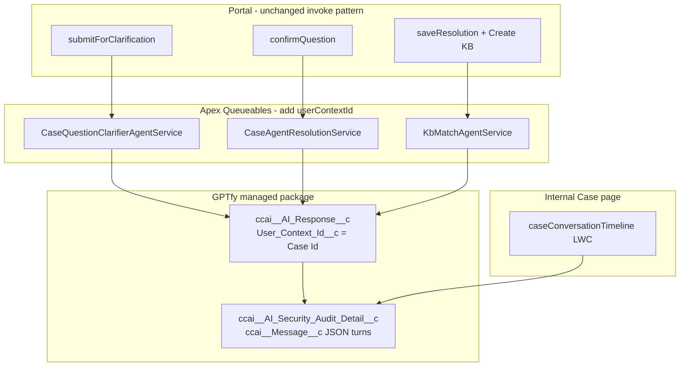

# Future PRD — Case AI Conversation Timeline (Path B)

| Field | Value |
|-------|-------|
| **Project** | GPTfy POC1 (Tungsten Automation) |
| **Status** | **Future / not in current release** — pending stakeholder approval |
| **Depends on** | Checkpoints 1–3 complete; four-route E2E stable |
| **Org** | `gptfy-poc1` (`kesavpoc@gptfy.com`) |
| **Last updated** | 2026-06-15 |
| **Related docs** | `SOLUTION_ARCHITECTURE.md`, `GPTfy_Community_User_InvokeAgent_Issue.md`, `KB_Match_Agent_Prompt.md` |

---

## 1. Summary

Support agents need a **Messaging Session–style transcript** on the Case record showing the full AI conversation: guest question, clarifier MCQs, resolver answer, and (when applicable) KB Match steps.

Today each GPTfy agent call creates activity in **Security Audit** (`ccai__AI_Response__c`), but portal Cases are not correlated to a single thread. GPTfy stores the **full multi-turn chat** on child records **`ccai__AI_Security_Audit_Detail__c`** in field **`ccai__Message__c`** (JSON array, up to 131,072 characters per child; additional children when the conversation grows).

This PRD defines a **future release** that:

1. Passes **`userContextId = Case Id`** on every existing **Apex Queueable** `invokeAgent()` call (no REST migration).
2. Delivers a read-only Case LWC **`caseConversationTimeline`** that renders the conversation from Security Audit Detail records.

---

## 2. Problem statement

| Pain | Today | Desired |
|------|--------|---------|
| Agent cannot see full AI journey on Case | Must open multiple Security Audits or guess from `Summary__c` / `Intent_Analysis__c` | One scrollable transcript on Case |
| Audits not tied to Case | Agent audits often have `ccai__Record_Id__c = null` | Correlate via `ccai__User_Context_Id__c = Case Id` |
| PII Added on parent audit is incomplete | Often one assistant blob; not full thread | Use **Audit Detail** `ccai__Message__c` JSON (roles + timestamps) |
| Clarifier / resolver / KB are separate invocations | Separate default contexts per call | **One session per Case** via shared `userContextId` |

---

## 3. Goals

| Goal | Success metric |
|------|----------------|
| Single conversation thread per Case | One parent Security Audit (or predictable query) per Case Id context |
| Agent-visible transcript on Case | LWC loads in &lt; 3 s for typical Case (&lt; 20 turns) |
| No regression to portal flows | Routes 1–4 E2E still pass after change |
| Stay on Apex Queueables | No switch to REST agentic API for production invoke |
| Minimal new metadata | **No** custom `GPTfy_User_Context_Id__c` — **Case Id is the context id** |

---

## 4. Non-goals (this release)

| Out of scope | Notes |
|--------------|-------|
| REST `/services/apexrest/ccai/v1/agentic/` for production | Postman/REST validated pattern; **Apex `invokeAgent()` only** |
| Guest/community transcript on portal | Internal Case page first (FLS / PII) |
| Merge clarifier + resolver into one GPTfy agent | Keep three agents; one **context** only |
| Re-clarify loop (“Refine question” on Other) | Separate future PRD item |
| Writing to Security Audit from Salesforce | Read-only LWC |
| Populating `ccai__Record_Id__c` on agent audits | Optional GPTfy vendor ask; not required if context = Case Id |

---

## 5. Users

| User | Need |
|------|------|
| **Support agent** | Read-only transcript while working Route 2 / 3 / 4 |
| **Admin / lead** | Audit AI quality, debug KB Match / clarifier issues |
| **Developer** | Query one Case Id → one conversation without time-window hacks |

---

## 6. Solution overview



### 6.1 Correlation key

**`userContextId` = `String.valueOf(Case.Id)`** on every `ccai.AIAgenticWebService.RequestWrapper` before `invokeAgent()`.

- Set on **first** clarifier call; same value on resolver and KB Match.
- LWC uses **`recordId`** (Case Id) — no extra Case custom field.

**Example:** Case `500dN00000PNpEkQAL` → `req.userContextId = '500dN00000PNpEkQAL'`.

### 6.2 Conversation data source

| Object | Field | Content |
|--------|-------|---------|
| `ccai__AI_Response__c` | `ccai__User_Context_Id__c` | Case Id (lookup key) |
| `ccai__AI_Security_Audit_Detail__c` | `ccai__AI_Security_Audit__c` | Lookup to parent audit |
| `ccai__AI_Security_Audit_Detail__c` | `ccai__Message__c` | JSON array of turns (max 131,072 chars) |
| `ccai__AI_Security_Audit_Detail__c` | `ccai__Type__c` | e.g. `Chat` |

**Turn shape (validated on audit A-00766 / AD-000534):**

```json
{
  "timestamp": "2026-06-15T13:49:39Z",
  "role": "user" | "assistant" | "developer",
  "content": "..."
}
```

When `ccai__Message__c` exceeds 131,072 characters, GPTfy creates **another Detail child** under the same parent audit. The LWC must **merge all Detail rows** ordered by `CreatedDate`, `Name`.

---

## 7. Feature: `caseConversationTimeline` LWC

### 7.1 Component identity

| Item | Value |
|------|-------|
| **LWC name** | `caseConversationTimeline` |
| **Master label** | Case Conversation Timeline |
| **Apex controller** | `CaseConversationTimelineController` |
| **Placement** | GPTfy Case layout — section or tab **“AI Conversation”** |
| **Audience** | Internal Lightning Case record page only (v1) |

### 7.2 UI requirements

| Requirement | Detail |
|-------------|--------|
| Layout | Vertical scroll; Messaging Session–like bubbles |
| User turns | `role = user` — inbound styling (e.g. right-aligned) |
| AI turns | `role = assistant` — outbound styling (e.g. left-aligned) |
| Skip empty | Omit `role = developer` when `content` is blank |
| Timestamps | Show per turn from `timestamp` (locale-formatted) |
| Rich content | `lightning-formatted-rich-text` for HTML in `content` |
| Empty state | “No AI conversation yet” when no audit/detail for this Case Id |
| Loading / error | Spinner; friendly error if FLS denies read |
| Read-only | No reply box; no new agent invoke from LWC |

### 7.3 Optional UI enhancements (v1.1)

- Collapse **KB Match** user/assistant turns under “Internal: KB deduplication”
- Link to parent Security Audit record
- Badge for agent phase inferred from turn content (Clarifier / Resolver / KB)

---

## 8. Feature: Apex `userContextId` on Queueables

### 8.1 Classes to change

| Class | When invoked | Change |
|-------|--------------|--------|
| `CaseQuestionClarifierAgentService` | Portal submit | `req.userContextId = String.valueOf(caseId)` |
| `CaseAgentResolutionService` | Portal confirm | Same |
| `KbMatchAgentService` | Agent resolve + Create KB | Same |

**Invoke pattern (unchanged except one line):**

```apex
ccai.AIAgenticWebService.RequestWrapper req =
    new ccai.AIAgenticWebService.RequestWrapper();
req.agentName     = AGENT_DEVELOPER_NAME;
req.userMessage   = userMessage;
req.userContextId = String.valueOf(caseId);
ccai.AIAgenticUtility.invokeAgent(req);
```

### 8.2 What does NOT change

- Queueable + `Database.AllowsCallouts` pattern
- Platform events (`Case_Clarification_Confirmed__e`, `Case_Resolved__e`)
- `Intent_Analysis__c`, `Summary__c`, Checkpoint 3 Description-on-close
- PII Added fallback in `QuestionClarifierAction` / `getClarification()` (keep as safety net; may add context-based lookup)

---

## 9. Apex controller — `CaseConversationTimelineController`

### 9.1 Public API

```apex
@AuraEnabled(cacheable=true)
public static ConversationTimeline getTimeline(Id caseId);
```

### 9.2 Query logic

1. `contextId = String.valueOf(caseId)`
2. Parent: `SELECT Id, Name FROM ccai__AI_Response__c WHERE ccai__User_Context_Id__c = :contextId ORDER BY LastModifiedDate DESC LIMIT 1`
3. Details: `SELECT Id, Name, ccai__Message__c, ccai__Type__c, CreatedDate FROM ccai__AI_Security_Audit_Detail__c WHERE ccai__AI_Security_Audit__c = :parentId AND ccai__Type__c = 'Chat' ORDER BY CreatedDate ASC, Name ASC`
4. Parse each `ccai__Message__c` as `List<Turn>`; concatenate; filter empty developer turns
5. Return DTO: `{ turns: [{ role, content, timestamp, sortOrder }], auditName, detailCount }`

### 9.2.1 Sharing

- Controller: `with sharing` for normal FLS **or** `without sharing` only if perm-set grants controlled read — **prefer with sharing + perm set**.

---

## 10. Security & permissions

| Object / field | Agent access |
|----------------|--------------|
| `ccai__AI_Response__c` | Read (query by `User_Context_Id__c`) |
| `ccai__AI_Security_Audit_Detail__c` | Read |
| `ccai__Message__c` | Read |

Add to **`GPTfy_Case_Fields_Access`** or new **`GPTfy_Conversation_Read_Access`** permission set assigned to support agents.

**Not** granted to Guest User in v1.

---

## 11. Dependencies & prerequisites

| Prerequisite | Status |
|--------------|--------|
| GPTfy agents active (Clarifier, Resolve, KB Match) | Done |
| `RequestWrapper.userContextId` in managed package | Verified in org |
| Audit Detail stores full JSON thread | Verified (A-00766 / AD-000534) |
| Stakeholder approval (Path B) | **Pending** |
| KB Match prompt plain-text output | Recommended before Route 3/4 in same release |

---

## 12. Acceptance criteria

### 12.1 Correlation (Queueables)

- [ ] After portal submit + confirm + agent KB path on one Case, SOQL `WHERE ccai__User_Context_Id__c = :caseId` returns **at least one** parent audit.
- [ ] All three agent types can share **one** parent audit for the same Case Id (validated in org with cursor-tagged Case).
- [ ] Existing Routes **1–4** verification scripts pass (`testE2E_Routes_Setup` / `Verify`).

### 12.2 Conversation LWC

- [ ] LWC on Case shows **user** and **assistant** turns in chronological order matching GPTfy Security Audit **Response** tab.
- [ ] Multi-chunk: if two Detail children exist, turns appear in one continuous timeline.
- [ ] Case with no GPTfy activity shows empty state (no error).
- [ ] HTML content (clarifier MCQs, resolver answer) renders readably.

### 12.3 Non-regression

- [ ] Community/guest clarifier still works (PII Added fallback if empty body).
- [ ] Checkpoint 3 Description format on close unchanged.
- [ ] No new required Case custom fields.

---

## 13. Test plan

| Test | Method |
|------|--------|
| Unit | `CaseConversationTimelineControllerTest` — mock JSON parse, merge two detail rows, skip developer |
| Unit | Assert `userContextId` set in clarifier/resolver/KB services (optional `@TestVisible` helper) |
| Org script | `scripts/apex/testCaseConversationTimeline.apex` — cursor-tagged Case, full portal path, query + debug turn count |
| Manual | Compare LWC to [Security Audit Response tab](https://gptfypoc-dev-ed.develop.lightning.force.com/lightning/r/ccai__AI_Response__c/a0RdN0000045Id7UAE/view) |
| Regression | `testE2E_Routes_Verify.apex`, `testCheckpoint3CaseDescription.apex` |

---

## 14. Effort estimate

| Phase | Scope | Estimate |
|-------|--------|----------|
| **Phase 1** | LWC + controller read-only (Case Id query); layout | 2–3 days |
| **Phase 2** | `userContextId` on 3 Queueables + tests | 2–3 days |
| **Phase 3** | Perm sets, UAT, Route 1–4 regression | 1–2 days |
| **Total** | | **~1–1.5 weeks** |

---

## 15. Risks & mitigations

| Risk | Impact | Mitigation |
|------|--------|------------|
| Community `invokeAgent()` empty body | Clarifier/resolver unchanged behavior | Keep PII Added fallback; LWC uses Detail JSON not sync body |
| Same Case Id reopens old session | Stale thread on reused Case | Document v1: one journey per Case; v2: suffix or TTL handling |
| KB Match HTML comments in assistant turn | KB gate fails (existing) | Update `KB_Match_Agent_Prompt.md` in org; optional parser strip `<!-- -->` |
| FLS blocks Detail read | Empty LWC for agents | Perm set before rollout |
| Parent `Agent_Name__c` = last agent only | Misleading if used for UI | LWC uses **Detail turns**, not parent agent name |

---

## 16. Future follow-ons (separate PRDs)

| Item | Description |
|------|-------------|
| Re-clarify on “Other” | Re-invoke clarifier with same Case Id context before confirm |
| Guest-visible transcript | Redacted subset on Experience Cloud |
| Human resolution bubble | Append agent `Resolution__c` as final turn when not in GPTfy |
| Session TTL / new context on same Case | `{caseId}-v2` strategy if GPTfy session expires |

---

## 17. Reference — org evidence

| Artifact | Finding |
|----------|---------|
| REST + `userContextId: demoo-route2-001` | Single parent audit A-00766; `responseBody` populated |
| [AD-000534](https://gptfypoc-dev-ed.develop.lightning.force.com/lightning/r/ccai__AI_Security_Audit_Detail__c/a0UdN000006NPBxUAO/view) | 9 turns in `ccai__Message__c`; type `Chat` |
| Apex probe | `RequestWrapper.userContextId` compiles; `recordId` not on wrapper |
| PII Added on parent | Only 1 message snapshot — **insufficient** for LWC; Detail is canonical |

---

## 18. Approval checklist (before development)

- [ ] Product owner approves Path B (Case Id as context)
- [ ] Confirms internal-only LWC for v1
- [ ] Confirms Apex Queueable-only (no REST)
- [ ] KB Match prompt updated in GPTfy admin (plain text markers)
- [ ] Support perm set assignment plan agreed

---

## 19. Document history

| Date | Change |
|------|--------|
| 2026-06-15 | Initial future PRD — conversation LWC + Case Id `userContextId` on Apex Queueables |
