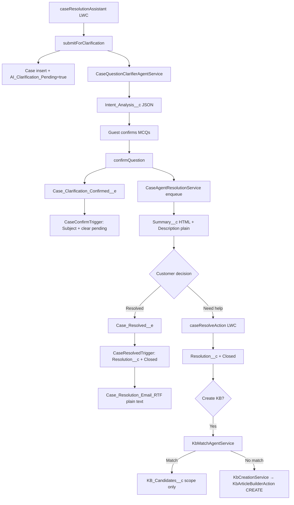

# GPTfy Support Portal — Solution Architecture

> **Org:** `gptfy-poc1` (`kesavpoc@gptfy.com`)  
> **Site:** Experience Cloud LWR site `gptfysupport1`  
> **Last updated:** June 2026

---

## Overview

Self-service AI support on Salesforce Experience Cloud with GPTfy (managed AI/RAG package). A guest describes an issue (≥10 words), receives AI clarification MCQs from the knowledge base, confirms context, and gets a formatted resolution. If unsatisfied, a human agent resolves the case and may optionally queue Knowledge article creation — **CREATE only, never UPDATE existing articles**.

**Interactive flowchart:** `docs/gptfy-solution-flow.html`  
**Metadata inventory:** `docs/METADATA_INVENTORY.md`

---

## Four Resolution Routes

| Route | Path | KB action |
|-------|------|-----------|
| **1** | AI resolves → customer satisfied → case closed | None |
| **2** | AI resolves → customer needs help → agent resolves manually | Optional CREATE if no match |
| **3** | Agent resolves manually + KB match found | **SKIP** — scope written to `KB_Candidates__c` |
| **4** | Agent resolves manually + no KB match | **CREATE** draft article |

---

## End-to-End Flow

---

## Phase 1 — Customer Input

| Component | File | Purpose |
|-----------|------|---------|
| LWC | `lwc/caseResolutionAssistant/` | Question input, clarification, resolution display |
| Controller | `CaseResolutionController` | Guest-facing `@AuraEnabled` methods |

1. Guest types or uses browser speech-to-text (≥10 words required).
2. **Submit** → `submitForClarification()` creates Case and enqueues clarifier.

---

## Phase 2 — AI Clarification

| Class | Role |
|-------|------|
| `CaseQuestionClarifierAgentService` | Queueable — invokes `Question_Clarifier_Agent` |
| `QuestionClarifierAction.buildJson()` | Parses agent text → JSON for LWC |

**Case fields:** `AI_Clarification_Pending__c=true`, `Intent_Analysis__c` (MCQ JSON), `Origin=Web`, initial `Subject`.

**Agent:** `Question_Clarifier_Agent` — RAG-backed MCQs (1–3 questions, never generic).

LWC polls `getClarification()` every 2s until `Intent_Analysis__c` is populated.

---

## Phase 3 — AI Resolution

`confirmQuestion(caseId, cleanedQuestion, agentMessage)`:

1. Publishes `Case_Clarification_Confirmed__e` → `CaseConfirmTrigger` updates `Subject`, clears pending flag.
2. Enqueues `CaseAgentResolutionService` **in the guest session** (not via Platform Event — GPTfy callouts fail as Automated Process).

**Agent:** `Case_Resolve_Agent` — RAG answer with HTML formatting.

| Field | Content | Consumer |
|-------|---------|----------|
| `Summary__c` | HTML answer | LWC rich text |
| `Description` | Plain text (`htmlToPlainText`) | Email body, KB context, list views |
| `Resolution__c` | Set on close only | Email flow gate |

`KB_REFS` block from agent is stripped before display; not persisted to Case fields.

---

## Phase 4 — Customer Decision

| Action | Result |
|--------|--------|
| **Yes, resolved** | `Case_Resolved__e` → close case → plain-text email |
| **Need more help** | Case stays open for agent |

Email flow (`Case_Resolution_Email_RTF`): uses `Case.Description` (plain text), `richTextFormattedBody=false`.

---

## Phase 5 — Agent Manual Resolution

**LWC:** `caseResolveAction` (Aura quick-action wrapper)

`CaseResolveActionController.saveResolution()`:
1. Sets `Resolution__c`, `Status=Closed`.
2. If Create KB checked: sets `Description=resolutionText`, enqueues `KbMatchAgentService`.

---

## Phase 5b — Knowledge Base (CREATE-only policy)

### Gate: `KbMatchAgentService`

Single agent-only gate — **no SOSL**, no candidate pipeline.

1. Invokes `KB_Match_Agent` with `Case.Subject` + `Description` (500 chars).
2. Normalizes HTML response (` ` → newlines, strip tags, decode entities).
3. Parses `KB_MATCHES_START…END` titles.
4. **Exact SOQL** `Title IN :titles` → match → **SKIP**.
5. **Fuzzy SOQL** `LIKE %keyword%` on distinctive words → match → **SKIP**.
6. No match / agent NONE / failure → chain `KbCreationService`.

**Skip path:** writes `KB_UPDATE_SCOPE` block to `Case.KB_Candidates__c` (label: **KB Update Scope**). No article created.

### Creation: `KbCreationService` → KB Creation Prompt → `KbArticleBuilderAction`

- Prompt generates structured CREATE response.
- `KbArticleBuilderAction` **always inserts** a new draft `Knowledge__kav`.
- UPDATE instructions from prompt are **ignored**.
- Links article via `CaseArticle`, writes `KB_Article_Link__c` URL.

---

## Platform Events

| Event | Publisher | Subscriber | Purpose |
|-------|-----------|------------|---------|
| `Case_Clarification_Confirmed__e` | `confirmQuestion()` | `CaseConfirmTrigger` | Update Subject; clear pending |
| `Case_Resolved__e` | `resolveCase()` | `CaseResolvedTrigger` | Close case; copy Summary→Resolution |

**Removed (deprecated):** `Case_AI_Requested__e` — attempted Guest→Automated Process agent routing; reverted to direct Queueable enqueue.

---

## GPTfy Agents & Prompt Actions

| Name | Type | Invoked by |
|------|------|------------|
| `Question_Clarifier_Agent` | Agent | `CaseQuestionClarifierAgentService` |
| `Case_Resolve_Agent` | Agent | `CaseAgentResolutionService` |
| `KB_Match_Agent` | Agent | `KbMatchAgentService` |
| KB Creation Prompt | Prompt | `KbCreationService` |
| `QuestionClarifierAction` | Prompt Action | Legacy/alternate clarifier path |
| `KbArticleBuilderAction` | Prompt Action | Post KB Creation Prompt |

Prompt docs: `docs/Question_Clarifier_Agent_Prompt.md`, `docs/Agent System Prompt`, `docs/KB_Match_Agent_Prompt.md`, `docs/KB Creation Prompt`.

---

## Security

**Guest permission set:** `gptfysupport_Guest_Access` — Case create/read, PE create, AI fields.

Guest Users cannot update Cases directly; Platform Events trigger system-context updates.

**Agent permission set:** `GPTfy_Case_Fields_Access` — internal Case + KB fields.

---

## Deprecated / Removed

| Item | Reason |
|------|--------|
| `Case_AI_Requested__e` + `CaseAIRequestTrigger` | Superseded by direct Queueable enqueue |
| `KbCandidateSearchService` | SOSL pipeline removed |
| `KbPromptContextService` | SOSL staging removed |
| `Case_Resolution_RTF` flow | Legacy prompt-on-create; **Obsolete** |
| `Case.KB_Update_Status__c` | Never implemented; replaced by `KB_Article_Link__c` |
| `createSupportCase()` | Legacy direct-resolve; LWC uses `submitForClarification()` |

---

## Design Decisions

**Why two agents (clarifier + resolver)?** Independent optimisation — clarifier finds knowledge gaps; resolver generates targeted answers.

**Why direct Queueable vs Platform Event for agents?** GPTfy `invokeAgent()` requires authenticated user context; Automated Process lacks it.

**Why dual Summary + Description?** HTML for LWC; plain text for email (no raw tags).

**Why CREATE-only KB?** Client policy — existing articles are flagged via KB Update Scope for human review, not auto-updated.
